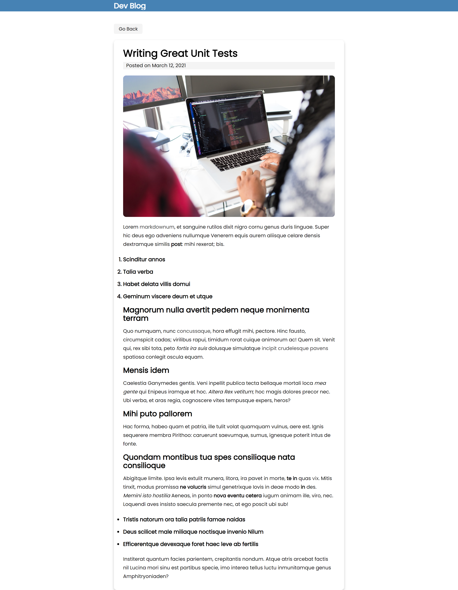

# REACT - Next.js Powered Static Blog Using Markdown

### Live Demo
https://nextjs-static-blog.netlify.app/

### About
Using the powerful React framework Next.js, we build a simple static blog with markdown and a few plug-ins: Grey Matter and Marked. Experience the power of static, server-side routing first hand!

### Screenshots

### Acknowlegement

Thanks to Traversy Media for another amazing tutorial.
